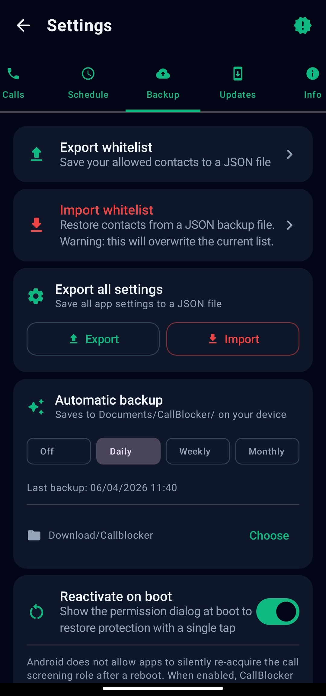

# CallBlocker

<p align="center">
  
</p>

<p align="center">
  <strong>Whitelist-based call protection for Android</strong><br/>
  Block every unknown caller. Let only your contacts through.
</p>

<p align="center">
  
  
  
  
</p>

---

## How it works

CallBlocker registers as Android's **CallScreeningService**. Every incoming call is intercepted before the phone rings:

1. If protection is suspended → allow
2. If suspended by schedule → allow / block per rule
3. If the number is in system contacts → allow
4. If the number is in the custom whitelist → allow
5. If the user recently called that number → allow (optional)
6. If STIR/SHAKEN attestation is FAILED → block (optional)
7. Otherwise → **block silently** (no ring, caller hears busy tone)

---

## Features

### 🛡️ Core protection
- **Whitelist-based blocking** — only allowed numbers can reach you
- **One-tap toggle** — enable or disable protection instantly from the home screen
- **Temporary suspension** — pause protection for 1 h / 3 h / 24 h or a custom duration

### 📋 Whitelist management
- Add numbers manually or import from device contacts
- Edit or delete individual entries
- Full-text search

### 📞 Call log
- Per-call detail view with block reason, timestamp, SIM slot
- Configurable log retention (7 / 30 / 90 days or forever)
- Delete individual entries or clear all

### ⚙️ Advanced blocking rules

| Rule | Description |
|------|-------------|
| **Retry rule** | Allow a blocked number through after *N* attempts within *M* minutes |
| **Dialed-number whitelist** | Auto-allow numbers you called in the last 1 / 6 / 24 / 48 hours |
| **STIR/SHAKEN** | Block calls flagged as *verification failed* by the carrier |

### 🗓️ Scheduling
- Define time windows (e.g. nights, weekends) for automatic enable/disable
- Per-day and per-time-range rules with exact `AlarmManager` triggers
- One-tap override for today or permanently

### 📱 Dual SIM
- Choose which SIM slot(s) to protect (SIM 1 / SIM 2 / Both)
- MIUI-compatible SIM detection via CallLog accountId mapping (ICCID not required)
- Per-feature SIM targeting for STIR/SHAKEN, dialed whitelist, and schedule rules

### 📲 Home screen widgets

| Widget | Size | Description |
|--------|------|-------------|
| **Toggle** | 2×1 | One-tap on/off — no need to open the app |
| **Status** | 2×2 | Protection state, whitelist count, last blocked call |

Both widgets are compatible with MIUI/HyperOS launchers.

### 🔔 Notifications
- Optional notification when a call is blocked
- Optional notification when a new app update is available

### 💾 Backup & restore

| Action | What it saves |
|--------|---------------|
| Export whitelist | Allowed contacts as JSON |
| Import whitelist | Restore contacts (overwrites current list) |
| **Export all settings** | Every preference (toggle states, rules, language, etc.) as JSON |
| **Import all settings** | Restore complete configuration — useful after reinstall or new device |
| Auto-backup | Whitelist exported automatically on a schedule (daily / weekly / monthly) |

### 🌍 Localisation
- English and Italian included
- System language auto-detection

---

## Requirements

- Android 10 (API 29) or higher
- The **CallScreeningService** role must be granted — the app will prompt you on first launch

> **Note on MIUI / HyperOS:** The system Quick Settings toggle may not reliably activate the role. The dedicated home screen **Toggle widget** is the recommended alternative.

---

## Permissions

| Permission | Why it is needed |
|-----------|-----------------|
| `READ_CONTACTS` | Import contacts into the whitelist |
| `READ_CALL_LOG` | Blocked call history; SIM slot detection on MIUI; dialed-number whitelist |
| `READ_PHONE_STATE` | Detect active SIM subscriptions for dual-SIM support |
| `POST_NOTIFICATIONS` | Show block notifications (Android 13+) |
| `RECEIVE_BOOT_COMPLETED` | Re-activate the screening role after reboot (opt-in) |
| `INTERNET` | Check for app updates (opt-in only) |

---

## Screenshots

<p align="center">
  
  
  
  
  
</p>

---

## Installation

1. Download the latest APK from the [Releases](../../releases) page.
2. Enable **Install from unknown sources** in Android Settings → Security.
3. Install the APK and open the app.
4. Tap **Activate** and grant the **Call Screening** role when prompted.
5. Add your allowed contacts and enable protection.

---

## Building from source

```bash
git clone https://github.com/amlet/callblocker.git
cd callblocker
./gradlew assembleDebug
```

**Requirements:** Android Studio Hedgehog 2023.1.1+ · JDK 17 · Min SDK 29 · Target SDK 34

---

## Tech stack

| Layer | Technology |
|-------|-----------|
| UI | Jetpack Compose, Material 3, Navigation Compose |
| Architecture | MVVM, StateFlow, Coroutines |
| Database | Room (SQLite) |
| Preferences | SharedPreferences |
| Serialization | kotlinx.serialization (JSON backup) |
| Call blocking | `CallScreeningService` (Android Telecom API) |
| Scheduling | `AlarmManager.setExactAndAllowWhileIdle()` |
| Background work | WorkManager (auto-backup, update check) |

---

## Project structure

```
src/main/
├── java/com/amlet/callblocker/
│   ├── data/
│   │   ├── backup/        BackupManager (JSON export/import)
│   │   ├── changelog/     In-app changelog data
│   │   ├── db/            Room database, DAOs, entities
│   │   ├── prefs/         AppPreferences (SharedPreferences wrapper)
│   │   └── repository/    ContactRepository
│   ├── service/
│   │   ├── CallBlockerService   Core CallScreeningService implementation
│   │   ├── BootReceiver         Re-prompts for role on boot
│   │   ├── ScheduleAlarmReceiver
│   │   └── ScheduleManager
│   ├── ui/
│   │   ├── components/    Reusable Compose components
│   │   ├── screens/       Home, Contacts, Call Log, Settings, etc.
│   │   ├── theme/         Color, Typography, Theme
│   │   └── viewmodel/     ContactViewModel
│   ├── widget/
│   │   ├── ToggleWidgetProvider   2×1 on/off widget
│   │   └── StatusWidgetProvider   2×2 info widget
│   ├── util/              LocaleHelper, NotificationHelper, PhoneUtils, UpdateChecker
│   └── worker/            AutoBackupWorker, UpdateCheckWorker
└── res/
    ├── drawable/          Vector icons, launcher foreground
    ├── layout/            Widget layouts
    ├── values/            Strings (EN), colors, themes
    ├── values-it/         Strings (IT)
    └── xml/               Widget provider metadata, backup rules
```

---

## License

MIT — see [LICENSE](LICENSE) for details.

---

## Credits

App developed by **Amlet**
