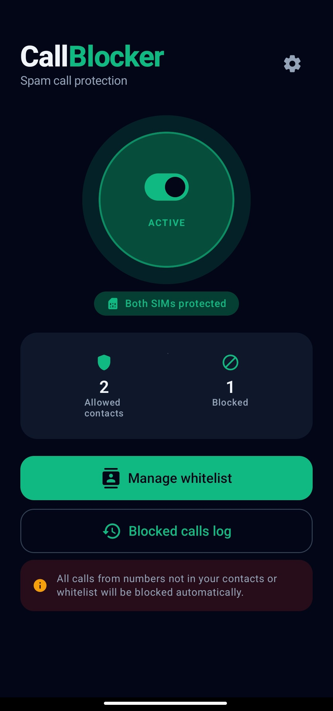
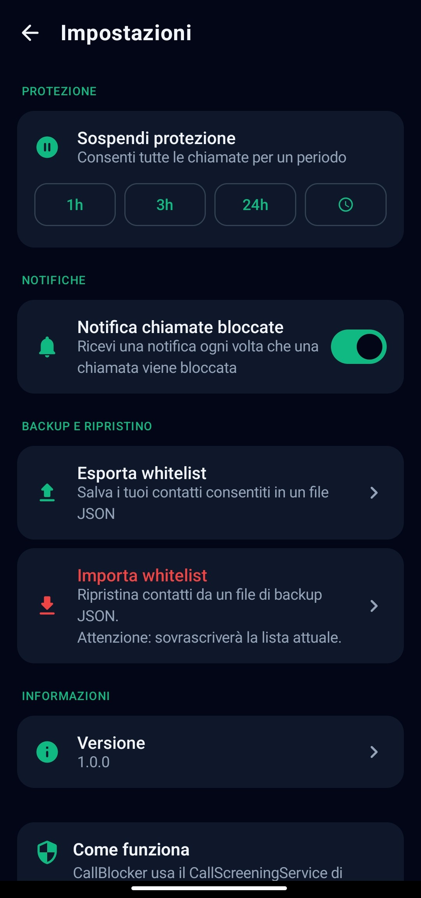
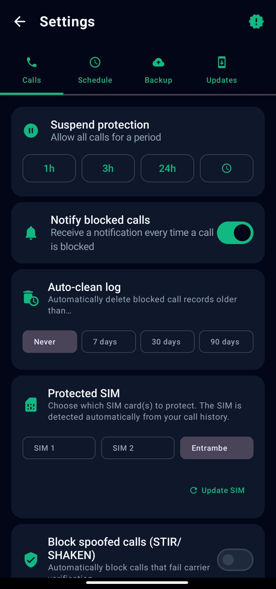
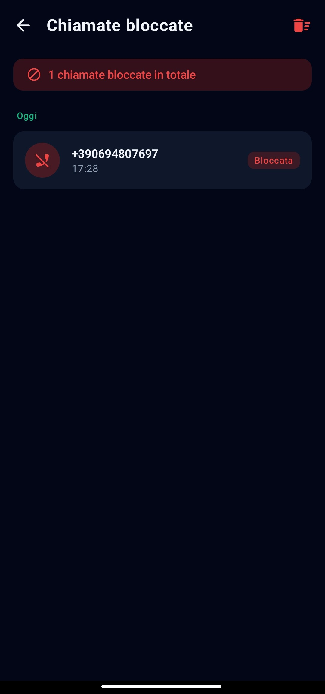

# CallBlocker

A privacy-first Android app that automatically blocks unwanted calls using a whitelist approach - only numbers in your contacts or custom whitelist are allowed through.

Built entirely with Kotlin, Jetpack Compose, and Room. No ads, no tracking, no data leaves your device.

---

## Features

- **Whitelist-based call blocking** — every call from an unknown number is rejected automatically
- **System contacts integration** — numbers already in your phonebook are always allowed
- **Custom whitelist** — add any number manually with a name and optional notes
- **Blocked calls log** — review every blocked call with date and time, grouped by day
- **Suspend protection** — temporarily disable blocking for 1h, 3h, 24h or a custom duration
- **Block notifications** — optional notification every time a call is blocked
- **Backup & restore** — export and import your whitelist as a JSON file
- **100% on-device** — no internet permission, no analytics, no cloud sync

---

## Screenshots

<p align="center">
  
  
  
  
</p>

---

## Requirements

| | |
|---|---|
| **Min Android version** | Android 10 (API 29) |
| **Target SDK** | Android 14 (API 34) |
| **Language** | Kotlin |
| **UI** | Jetpack Compose + Material 3 |

---

## Tech Stack

| Layer | Technology |
|---|---|
| UI | Jetpack Compose, Material 3, Navigation Compose |
| Architecture | MVVM, StateFlow, Coroutines |
| Database | Room (SQLite) |
| Preferences | SharedPreferences |
| Serialization | kotlinx.serialization (JSON backup) |
| Call blocking | `CallScreeningService` (Android Telecom API) |

---

## How It Works

CallBlocker registers as the system's **Call Screening Service**. When an incoming call arrives, Android routes it through the app before ringing:

1. If protection is suspended → allow
2. If the number is in the system contacts → allow
3. If the number is in the custom whitelist → allow
4. Otherwise → block and reject silently

The app must be set as the default **Call Screening** app in system settings (Android will prompt you on first launch).

---

## Architecture

The app follows a clean MVVM architecture:

- **data/** — Room database, repositories, preferences, backup
- **ui/** — Jetpack Compose screens and ViewModels
- **service/** — CallScreeningService implementation
- **util/** — Utility classes

This structure keeps business logic separated from UI and Android components.

---

## Getting Started

### Prerequisites

- Android Studio Hedgehog (2023.1.1) or newer
- JDK 17

### Build

1. Clone the repository
   ```bash
   git clone https://github.com/amletoflorio/callblocker.git
   ```
2. Open the project in Android Studio
3. Let Gradle sync
4. Run on a device or emulator (API 29+)

### First Run

On first launch the app requests:
- `READ_CONTACTS` — to check if a caller is in your phonebook
- `READ_CALL_LOG` — to display blocked call history
- `POST_NOTIFICATIONS` — to send block notifications (Android 13+)
- **Call Screening role** — the system dialog that makes blocking actually work

---

## Permissions

| Permission | Why |
|---|---|
| `READ_CONTACTS` | Check if caller is in system contacts |
| `READ_CALL_LOG` | Display blocked call log |
| `POST_NOTIFICATIONS` | Optional block notifications (Android 13+) |
| `WRITE_EXTERNAL_STORAGE` | Backup export on Android 9 and below |
| `READ_EXTERNAL_STORAGE` | Backup import on Android 12 and below |
| `BIND_SCREENING_SERVICE` | Required to register as Call Screening Service |

No `INTERNET` permission — the app is fully offline.

---

## License

[](LICENSE)

---

## Version


---

## Credits

App developed by **Amlet**